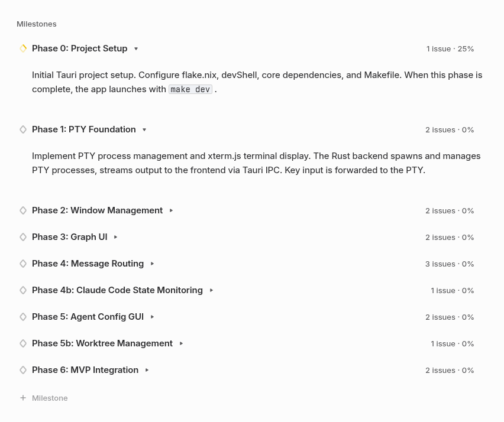

# agent-cockpit

A Tauri desktop application for running and orchestrating multiple AI agents as a team.
Each agent runs in its own PTY terminal window. Windows are connected by edges (lines) that define communication channels between agents.

## Concept

```
+------------------+        +------------------+
|  Leader Agent    |------->|  Member Agent A  |
|  (PTY window)    |        |  (PTY window)    |
+------------------+        +------------------+
         |
         v
+------------------+
|  Member Agent B  |
|  (PTY window)    |
+------------------+
```

- **Window**: A PTY terminal running an agent process (e.g. `claude`). Can be freely positioned and resized like a desktop environment.
- **Edge**: A directed connection between two windows. Defines which agents can communicate with each other.
- **Message**: A Linear Issue Comment posted by an agent. cockpit delivers it to the target agent's PTY stdin via the edge.

## Architecture

```
Frontend (React + TypeScript)
  - Window manager (DE-like free layout)
  - SVG edge overlay (graph visualization)
  - xterm.js terminal emulator
  - Agent config UI
  - Worktree management UI

Backend (Rust + Tauri)
  - PTY process management (portable-pty)
  - IPC bridge (Tauri commands/events)
  - Linear API client (message polling / webhook receiver)
  - Claude Code hooks manager
  - Git worktree manager
```

## Tech Stack

| Layer | Technology |
|---|---|
| Desktop framework | Tauri 2 |
| Frontend | React 19, TypeScript, Vite |
| Backend | Rust (stable) |
| Package manager | pnpm 10, Node 24 |
| Formatter | treefmt (nixfmt, rustfmt, prettier) |
| Platforms | x86_64-linux, aarch64-darwin |

## Agent Messaging

Agents communicate through **Linear Issue Comments** as the message transport layer.

### Flow

1. Agent A posts a comment on a Linear Issue addressed to Agent B
2. cockpit receives the comment via Linear Webhook (or polling as fallback)
3. cockpit checks the edge graph: is Agent A connected to Agent B?
4. If connected, cockpit injects the comment body into Agent B's PTY stdin

### Linear Setup

- Each agent is associated with a Linear Issue (its task)
- Comments on that Issue are the agent's inbox
- `LINEAR_API_KEY` must be set in the environment
- Webhook endpoint is started by cockpit at launch (fallback: polling interval configurable in settings)



Sample linear project.

## Claude Code State Monitoring

cockpit monitors each agent's state using **Claude Code hooks**.

### States

| State | Hook event | UI indicator |
|---|---|---|
| Waiting for input | `Stop` | Green border |
| Executing tool | `PostToolUse` | Yellow border |
| Thinking | `PreToolUse` | Blue border |
| Error | non-zero exit | Red border |

### Hook Isolation

To avoid polluting the user's global `~/.claude/settings.json`, cockpit manages hooks at the **worktree level**:

- On worktree creation, cockpit writes `.claude/settings.json` inside the worktree directory
- Hook scripts report agent state to cockpit via a local Unix socket (or named pipe on Windows)
- The user's global Claude configuration is never modified

## Worktree Management

Each agent runs inside its own **git worktree**, keeping branches isolated.

### Configuration (per repository)

| Key | Description |
|---|---|
| `basedir` | Directory where worktrees are created |
| `hook` | Shell command to run after worktree creation (e.g. `pnpm install`) |
| `deletehook` | Shell command to run before worktree deletion |
| `copyignored` | Copy `.gitignore`-listed files (e.g. `.env`) into new worktrees |

### Lifecycle

1. User opens a new agent window in cockpit
2. cockpit creates a git worktree in `basedir/<branch-name>`
3. cockpit runs `hook` inside the worktree
4. cockpit writes `.claude/settings.json` with hook definitions
5. cockpit spawns the agent process (PTY) in the worktree directory
6. Window title bar shows the worktree branch name
7. On window close: cockpit runs `deletehook`, then removes the worktree

## Development Setup

### Prerequisites

Using Nix (recommended):

```bash
nix develop
```

Or manually: Rust (stable), Node 24, pnpm 10.

### Commands

```bash
make install    # install frontend dependencies
make dev        # launch Tauri app in development mode
make dev-web    # launch frontend only (browser)
make build      # production build
make fmt        # format all code (nix fmt)
make clean      # remove build artifacts
```

## MVP

The first milestone (Phase 6) targets a **3-agent configuration**:

- 1 Leader agent
- 2 Member agents

The leader receives a task from the human operator, breaks it down, and delegates to the two members via Linear Issue Comments. Members execute and report back.

## Development Roadmap

| Phase | Milestone | Key deliverables |
|---|---|---|
| 0 | Project setup | flake.nix, Makefile, base dependencies |
| 1 | PTY foundation | portable-pty backend, xterm.js frontend, IPC |
| 2 | Window management | DE-like layout, drag, resize, z-order |
| 3 | Graph UI | SVG edge overlay, edge create/delete |
| 4 | Message routing | Linear webhook/polling, PTY stdin injection |
| 4b | Agent state monitoring | Claude Code hooks, per-worktree settings |
| 5 | Agent config GUI | Config model, TOML persistence, settings UI |
| 5b | Worktree management | git worktree lifecycle, UI |
| 6 | MVP integration | 3-agent demo, end-to-end validation |

All tasks are tracked in the [Linear project](https://linear.app/conao3/project/rust-agent-cockpit-2c9d205c0d4d).

## Agent Working Instructions

> Read this section before starting any implementation work.

### Before you start

1. Read this README in full
2. Check your assigned Linear Issue for the task description and acceptance criteria
3. Confirm which Phase your task belongs to — do not implement features from later phases
4. Create or switch to the appropriate git worktree for your branch

### Branch naming

Follow the Linear-generated branch name shown on each Issue (e.g. `conao3/con-21-pty-backend`).

### Code style

- No comments in code
- No `scripts` in `package.json` — use `Makefile` targets only
- TypeScript: use `as const` to narrow types
- Rust: standard `rustfmt` formatting
- File endings: newline at end of file, no trailing whitespace

### Committing

- Do not commit unless explicitly instructed
- Commit messages: lowercase English, no `Co-authored-by`
- Run `make fmt` before committing

### Completing a task

1. Ensure the feature works end-to-end
2. Update the Linear Issue status to Done
3. Post a summary comment on the Linear Issue describing what was implemented
